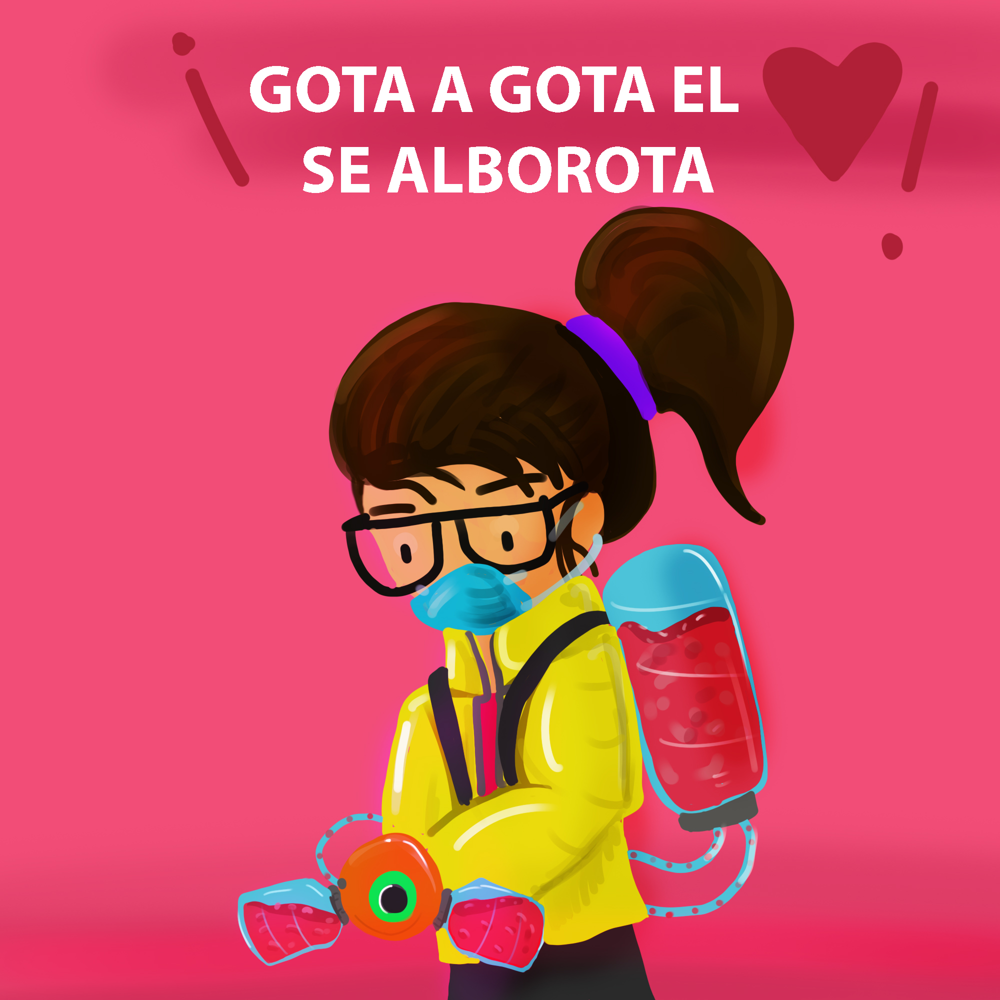

## ¡Bienvenido!
### Yo soy Margarita 

  
    
  
    
### ¡Conoce mi proyecto! 
  

**¿Sabías que?** Las donaciones de sangre son más necesarias que nunca durante la actual pandemia por COVID-19. 
Es por eso que este espacio está diseñado para las personas que se encuentran en busca de donadores y para todas aquellas personas que quieren y está en sus posibilidades apoyar. 
La finalidad de este proyecto es tener un panel de oportunidades más amplio para la población del estado de **Guanajuato**.

Dentro de esta página encontraras información necesaria para entender un poco más sobre la importancia de Donar, y si nunca has donado, espero que te motive a hacerlo.

  
### Dona Sangre, Salva vidas
  

Las donaciones de sangre que se hacen cada día contribuyen a salvar vidas, las cuales pueden pertener a mujeres con complicaciones obstétricas, niños que presenten un cuadro de anemia grave, personas con traumatismo graves o pacientes de intervenciones quirúrgicas y pacientes que requieren transfusiones periódicas por cáncer, operaciones u otros.

Enseguida te compartire algunos puntos interesantes sobre la donación de sangre, esperando que así te sumes a la causa.

1. Donando una vez puedes ayudar a tres personas, así es. La sangre puede dividirse en tres productos diferentes, lo cual puede ayudar entre 3 y 4 personas.  

2. La sangre caduca aproximadamente en 45 días, por lo tanto, es necesaria la donación constante de las personas.  

3. Cada 4 minutos, una persona requiere una transfusión sanguínea.  

5. Si donaras 3 veces al año si eres mujer o 4 veces si eres hombre, desde los 18 hasta los 65 años, salvarías más de 500 vidas. 

6. Más del 25% de nosotros necesitará sangre al menos una vez en la vida.  

7. Por cada 10 donadores de sangre, se rechazan 4.   

8. Los donadores de sangre tienen menos riesgo de padecer diabetes y ataques al corazón.  

9. La donación es de 400 ml a 450 ml de sangre, una cantidad que no provoca ningún tipo de cambio en el cuerpo humano.  

  
### Compatibilidad
  
Es importante conocer sobre la compatibilidad que tienen los distintos grupos sanguineos. 
<html>
<head><title>Ejemplo de tabla sencilla</title></head>
<body>

<table>
<tr>
  <td><strong>Grupo</strong></td>
  <td><strong>A quien puede donar</strong></td>
  <td><strong>De quien puede recibir</strong></td>
</tr>

<tr>
  <td>A+</td>
  <td>A+ y AB+</td>
  <td> A± y O±</td>
</tr>
<tr>
  <td>A-</td>
  <td> A± y AB±</td>
  <td> A- y O-</td>
</tr>
<tr>
  <td>B+</td>
  <td> B+ y AB+</td>
  <td>B± y O±</td>
</tr>
<tr>
  <td>B-</td>
  <td>B± y AB±</td>
  <td> B- y O-</td>
</tr>

<tr>
  <td>AB+</td>
  <td>AB+</td>
  <td>RECEPTOR UNIVERSAL</td>
</tr>
<tr>
  <td>AB-</td>
  <td>AB±</td>
  <td> A-, B-, AB- y O-</td>
</tr>
<tr>
  <td>O+</td>
  <td> A+, B+, AB+ y O+</td>
  <td> O±</td>
</tr>
<tr>
  <td>O-</td>
  <td>DONANTE UNIVERSAL</td>
  <td>O-</td>
</tr>
</table>

</body>
</html>

  
### Quiero Donar
  

Entre los requerimientos generales tienes que tomar en cuenta lo siguiente: 

 Lo principal es tener una edad de 18 a 65 años

1. Peso mayor de 50 kilogramos.
2. No haber estado enfermo de gripe, tos, diarrea o infección dental en los últimos 14 días.
3. No haber tomado medicamentos en los últimos cinco días.
4. No haber estado en tratamiento de endodoncia, acupuntura o haberse practicado tatuajes o perforaciones en los últimos 12 meses.
5. No haber sido operado en los últimos seis meses.
6. No haberse vacunado en los últimos 30 días.
7. No haber ingerido bebidas alcohólicas en 72 horas previas a la donación.
8. Si tienes la presión arterial alta y estás controlada o controlado, puedes ser candidato a donación.

Si estas interesado en Donar sangre, plasma o entrar en un proceso de Donación de Organos, deja tu comentario para que pueda llegar a más personas en el estado de **Guanajuato** y así todos tengamos un mayor campo de oportunides. 

Agrega a tu comentario un **correo electronico** para que puedan contactarte. **No agregues tu número telefónico**, esto con la finalidad de evitar el mal uso de la información.

  
### Busco Donadores 
  

Sabemos lo dificil que es buscar donadores y es por eso que ofrecemos este espacio para encontrar una esperanza más. 

Te pido que postees en los comentarios los requisitos necesarios para poder Donar y un **correo electronico** para que todo interesado pueda contactarse. **No agregues tu número telefónico**, esto con la finalidad de evitar el mal uso de la información.

  
### Comentarios
  

Escribe en la caja de comentarios si buscas un donador o si estás interesado en donar, esto ayudará a que la página llegue a más personas en el estado.

Específica en tu comentario toda la información posible, si te gustaría ser Donador o necesitas Donadores e incluye: 

- Tipo de sangre
- Municipio (**No publiques tu dirección, no números telefónicos**)
- Correo electrónico para que puedan contactarte 

   **Recuerda que el mundo es de las personas que se levantan y aportan con sus acciones para hacerlo crecer, y de todos aquellos que no se rinden y siguen adelante**. 
   
### ¡No estas aquí por casualidad!

<noscript>Please enable JavaScript to view the <a href="https://disqus.com/?ref_noscript">comments powered by Disqus.</a></noscript>
